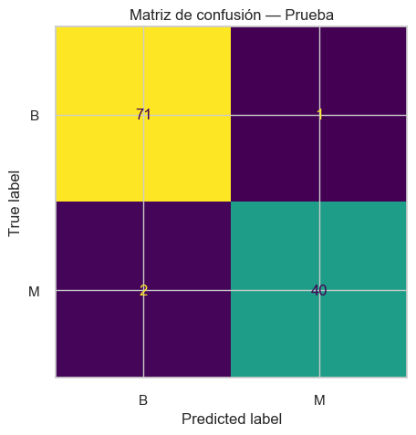
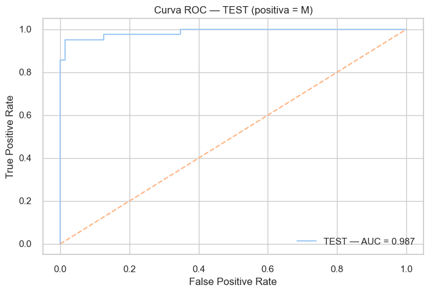
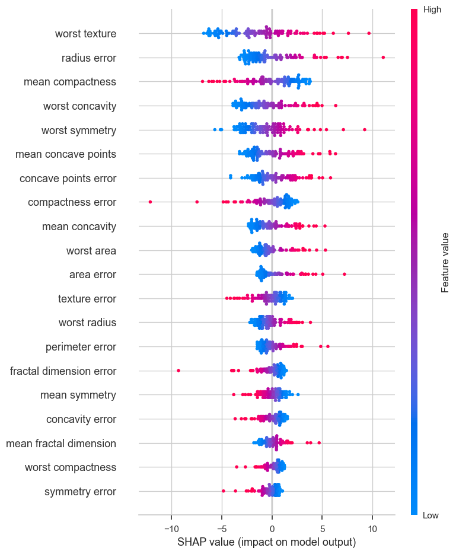

# Breast Cancer Classification with Explainable Machine Learning

Explainable Machine Learning pipeline for binary breast tumor classification using the Wisconsin Diagnostic Breast Cancer dataset.

The project combines data preprocessing, class imbalance handling, model benchmarking, hyperparameter tuning and SHAP-based interpretability to distinguish between benign and malignant tumors.

---

## Project Overview

This project explores the use of supervised Machine Learning for binary classification of breast tumors as:

- **B — Benign**
- **M — Malignant**

The objective was to build and evaluate a robust classification pipeline while paying particular attention to malignant-case detection, model generalization and interpretability.

The project uses the Wisconsin Diagnostic Breast Cancer dataset, containing:

- **569 observations**
- **30 numerical predictor variables**
- **357 benign cases**
- **212 malignant cases**
- **No missing values**

The input variables describe characteristics such as radius, texture, perimeter, area, compactness, concavity and symmetry.

---

## Methodology

The modeling workflow includes:

1. Dataset loading and validation
2. Exploratory analysis
3. Stratified Train/Test split
4. Feature standardization
5. Class imbalance handling using SMOTE
6. Model benchmarking with PyCaret
7. 5-fold cross-validation
8. Model selection using ROC-AUC
9. Hyperparameter tuning
10. Independent Test evaluation
11. Confusion matrix and ROC analysis
12. Model interpretation using SHAP

The dataset was divided using an **80/20 stratified split**, preserving the original class proportions.

SMOTE was applied only to the training data in order to reduce class imbalance without modifying the Test distribution.

---

## Model Selection

Multiple classification algorithms were evaluated using PyCaret.

The comparison included models such as:

- Logistic Regression
- Random Forest
- Extra Trees
- Gradient Boosting
- LightGBM
- Linear Discriminant Analysis
- Quadratic Discriminant Analysis
- K-Nearest Neighbors
- Naive Bayes

The final model was selected based primarily on cross-validation ROC-AUC.

A tuned **Logistic Regression** model achieved the strongest overall balance between discrimination performance, interpretability and model simplicity.

---

## Final Model

**Tuned Logistic Regression**

The final model included hyperparameter optimization and class balancing considerations.

Logistic Regression was selected not because of model complexity, but because it achieved excellent predictive performance while remaining highly interpretable.

---

## Test Results

| Metric | Test Performance |
|---|---:|
| Accuracy | **97.4%** |
| Precision - Malignant | **97.6%** |
| Recall - Malignant | **95.2%** |
| F1-score - Malignant | **96.4%** |
| ROC-AUC | **~0.987** |

The model correctly classified **111 of 114 Test observations**.

---

## Confusion Matrix

The Test confusion matrix was:

| | Predicted Benign | Predicted Malignant |
|---|---:|---:|
| **Actual Benign** | 71 | 1 |
| **Actual Malignant** | 2 | 40 |

The model correctly identified **40 of 42 malignant cases**, corresponding to a malignant-class Recall of approximately **95.2%**.

For this problem, Recall for the malignant class is particularly important because false negatives represent malignant cases incorrectly predicted as benign.

---

## Model Evaluation

### Model Comparison

The candidate models were compared using cross-validation performance before selecting and tuning the final estimator.


---

### Confusion Matrix

The confusion matrix provides a detailed view of classification performance on the independent Test set.



---

### ROC Curve

The final model achieved strong discriminatory performance, with an ROC-AUC of approximately **0.987**.



---

## Explainable AI with SHAP

Model interpretation was performed using SHAP to analyze how individual predictor variables influenced the classifier.

The analysis highlighted variables related to:

- texture
- radius
- compactness
- concavity
- concave points
- symmetry
- area

as important contributors to model predictions.



SHAP complements traditional evaluation metrics by providing insight into the features that influence the model's decisions.

---

## Technologies

- Python
- Pandas
- NumPy
- Scikit-learn
- PyCaret
- Imbalanced-learn
- SMOTE
- Logistic Regression
- SHAP
- Matplotlib
- Jupyter Notebook

---

## Repository Structure

```text
breast-cancer-explainable-ml/
│
├── notebooks/
│   └── breast_cancer_classification.ipynb
│
├── results/
│   ├── model_comparison.png
│   ├── confusion_matrix.png
│   ├── roc_curve.png
│   └── shap_feature_importance.png
│
├── README.md
├── requirements.txt
└── .gitignore
